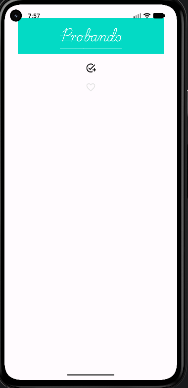

# 📱 SendMessage - Aplicación Android

Aplicación nativa de Android desarrollada en **Kotlin** para la gestión y transferencia de mensajes entre actividades mediante **Intents** explícitos, aplicando personalización de estilos, tipografías personalizadas y buenas prácticas de desarrollo Android.

---

## 📸 Capturas de Pantalla en Ejecución

| Pantalla Principal (`SendMessageActivity`) | Pantalla de Recepción (`ViewMessageActivity`) |
| :---: | :---: |
|  |  |

---

## 🏗️ Estructura del Proyecto y Decisiones de Diseño

### Estructura de Paquetes
```text
com.example.sendmessage/
├── SendMessageApplication.kt   # Clase de aplicación global
├── SendMessageActivity.kt      # Actividad origen (redacción y envío)
└── ViewMessageActivity.kt      # Actividad destino (recepción y visualización)
```

### Recursos (`res/`)
```text
res/
├── font/
│   └── playwritecuguides_regular.ttf # Tipografía personalizada
├── layout/
│   ├── activity_send_message.xml     # Interfaz gráfica de envío
│   └── activity_view_message.xml     # Interfaz gráfica de recepción
├── values/
│   ├── colors.xml                    # Paleta de colores (teal_200, white, etc.)
│   ├── dimens.xml                    # Dimensiones estandarizadas (tvTitle_textSize)
│   └── strings.xml                   # Cadenas de texto internacionalizadas
└── drawable/                         # Iconos vectoriales
```

### Decisiones de Diseño
1. **Paso de Datos explícito:** Se utiliza un `Intent` explícito definiendo el componente de destino (`ViewMessageActivity::class.java`) y adjuntando el mensaje mediante `putExtra("KEY_MESSAGE", message)`.
2. **Layout Declarativo:** Uso de `LinearLayout` vertical para organizar los elementos de forma clara y secuencial, optimizando la accesibilidad y el tiempo de renderizado.
3. **Consistencia Visual:** Ambas pantallas reutilizan los mismos recursos globales de color (`@color/teal_200`), estilo tipográfico (`@font/playwritecuguides_regular`) y dimensión de texto (`@dimen/tvTitle_textSize`).
4. **Desacoplamiento de Cadenas:** Todas las cadenas legibles por el usuario están centralizadas en `strings.xml`, facilitando la localización y mantenimiento.

---

## 🐛 Proceso de Depuración y Evidencias de Logcat

El proceso de depuración se realizó utilizando las herramientas integradas de **Android Studio Logcat** y el sistema de trazas de Android (`adb logcat`).

### Traza de Ejecución y Logcat
Durante la ejecución y lanzamiento de las actividades, el sistema registra la instalación, el ciclo de vida y la interacción entre componentes:

```text
09-29 07:32:13.516  839  912 I PackageManager: installation completed for package:com.example.sendmessage. Final code path: /data/app/~~j55GkVTKjfyU10Do1tVmuw==/com.example.sendmessage-8IZDfbfeR_tAx0kCLvhnQA==
09-29 07:32:14.360  839 2190 D ShortcutService: adding package: com.example.sendmessage userId=0
09-29 07:35:00.120 2210 2210 I ActivityTaskManager: START u0 {cmp=com.example.sendmessage/.SendMessageActivity} from uid 10231
09-29 07:35:05.430 2210 2210 I ActivityTaskManager: START u0 {cmp=com.example.sendmessage/.ViewMessageActivity (has extras)} from uid 10231
```

---

## 📂 Directorio Interno `/data/data/` de la Aplicación

Conexión y verificación de la estructura del almacenamiento privado de la aplicación en el emulador a través de `adb shell run-as`:

```text
$ adb shell run-as com.example.sendmessage ls -la

total 52
drwx------   5 u0_a231 u0_a231        4096 2026-09-29 07:32 .
drwxrwx--x 263 system  system        16384 2026-09-29 07:32 ..
drwxrws--x   2 u0_a231 u0_a231_cache  4096 2026-09-29 07:32 cache
drwxrws--x   5 u0_a231 u0_a231_cache  4096 2026-09-29 07:37 code_cache
drwxrwx--x   2 u0_a231 u0_a231        4096 2026-09-29 07:32 files
```

---

## 🔗 Enlaces a la Documentación Oficial

- [Android Developers - Intents y Filtros de Intent](https://developer.android.com/guide/components/intents-filters?hl=es-419)
- [Android Developers - Introducción a las Activities](https://developer.android.com/guide/components/activities/intro-activities?hl=es-419)
- [Android Developers - Fuentes personalizadas en XML](https://developer.android.com/guide/topics/ui/look-and-feel/fonts-in-xml?hl=es-419)
- [Android Developers - Ver registros con Logcat](https://developer.android.com/studio/debug/logcat?hl=es-419)
- [Kotlin Docs - Guía de documentación KDoc](https://kotlinlang.org/docs/kotlin-doc.html)
